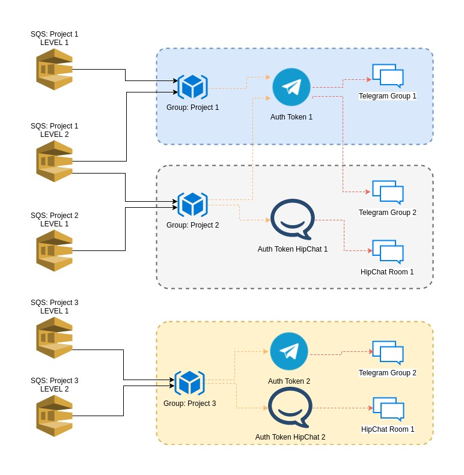

[](https://goreportcard.com/report/github.com/gabrielperezs/CARBOnic)

CARBOnic - Trigger SQS messages to Telegram, HipChat and Slack
------------
It's a daemon to "listen" messages from SQS and send it to a chat platform. Really useful to handle alarms from AWS CloudWatch (SNS -> SQS).

You can organice the alarms based in groups and level of the alarms. Depends of the alarm the message will be send to all the channels or just to one.

With simple command like "/catch" the damon will delete the message from the SQS Queue and will comunicate to the Chats (hipchat, telegram..) than you are in carge of the alarm (ACK).

Features
--------

- Organice your alarms in Groups
- Define the score of each SQS source
- Define the score of the chat groups (telegram, hipchat)
- Use simple commands to handle the alarms

**Other internal features**

- Create one session to AWS services based in [profiles](http://docs.aws.amazon.com/cli/latest/userguide/cli-chap-getting-started.html#cli-multiple-profiles) and share it with more than one SQS source.
- You can use more than one telegram clients
- Use one connection to telegram (token based) and share this connection with more than one group
- You can use more than one hipchat clients
- Use one pull to hipchat based on RoomID and token and share it with more than one group


**Example of connections**



Config file
-----------

```toml
[[Group]]
    Name = "Group 1"

    [[Group.Chat]]
    Type = "telegram"
    Name = "Telegram client 1"
    Token = "0000000000:ZZZZZZZZZZZZZZZZZZZZZZZZZZZZZZZZZZ"
    Group = -00000000
    MinScore = 10

    [[Group.Input]]
    Type = "sqs"
    URL = "https://sqs.eu-west-1.amazonaws.com/000000000000/PROJECT_1_LEVEL1"
    Region = "eu-west-1"
    Profile = "project1"
    Score = 10

    [[Group.Input]]
    Type = "sqs"
    URL = "https://sqs.eu-west-1.amazonaws.com/000000000000/PROJECT_1_LEVEL2"
    Region = "eu-west-1"
    Profile = "project1"
    Score = 5


[[Group]]
    Name = "Project 2"

    # Same as group 1
    [[Group.Chat]]
    Type = "telegram"
    Name = "Telegram client 1"
    Token = "0000000000:ZZZZZZZZZZZZZZZZZZZZZZZZZZZZZZZZZZ"
    Group = -00000000
    MinScore = 10

    [[Group.Chat]]
    Type = "hipchat"
    Name = "HipChat client 1"
    Token = "ZZZZZZZZZZZZZZZZZZZZZZZZZZZZZZZZZZZZZZZZZZZ"
    RoomID = "999999"
    MinScore = 5

    [[Group.Input]]
    Type = "sqs"
    URL = "https://sqs.us-west-2.amazonaws.com/000000000000/PROJECT_2_LEVEL1"
    Region = "us-west-2"
    Profile = "project1"
    Score = 10

    # Same as group 1
    [[Group.Input]]
    Type = "sqs"
    URL = "https://sqs.eu-west-1.amazonaws.com/000000000000/PROJECT_1_LEVEL2"
    Region = "eu-west-1"
    Profile = "project1"
    Score = 5


[[Group]]
    Name = "Project 3"

    [[Group.Chat]]
    Type = "telegram"
    Name = "Telegram client 2"
    Token = "1111111111:YYYYYYYYYYYYYYYYYYYYYYYYYYYYYYYYYY"
    Group = -0000001111
    MinScore = 10

    [[Group.Chat]]
    Type = "hipchat"
    Name = "HipChat client 2"
    Token = "YYYYYYYYYYYYYYYYYYYYYYYYYYYYYYYYYYYYYYYYY"
    RoomID = "0000111"
    MinScore = 5

    [[Group.Input]]
    Type = "sqs"
    URL = "https://sqs.us-west-2.amazonaws.com/000000000000/PROJECT_3_LEVEL1"
    Region = "us-west-2"
    Profile = "project3"
    Score = 10

    [[Group.Input]]
    Type = "sqs"
    URL = "https://sqs.eu-west-2.amazonaws.com/000000000000/PROJECT_3_LEVEL2"
    Region = "eu-west-2"
    Profile = "project3"
    Score = 5

```

Commands
---------

The can read this commands from all the channels where his is connected.

The commands will afect just to the SQS sources of the group. For example, if you have two groups with his own sqs source and connected to hipchat, after send /purge command to the group 1, only the sqs from the group 1 will be deleted.


**/catch** - will send a message to chat/rooms comunicating you are in charge of the alarm

**/purge** - will send a "purge" (delete all mensages) from the SQS

**/ping** - Test if the boot is alive


Origin of the project
---------------------

In my current job we need to handle alarms from an AWS hosted platform. The alarms are group based, depends of the alarm it should be trigger to part of the team. Also we needed levels for the alarms. Some of them could be handle during laboral hours and the most important should be handle inmediatly, doesn't matter the hour. The sys admins knows what I'm talking about, eh? ;)

We didn't want to install more apps in the phone or build our own app, with all the complexity that requires in terms of manteniment (Android, iPhone, versions, Appel/Google stores validations.. etc..). So the plan was use existing chat platforms. 

In future versions could be included slack, zulip, facebook messages..


